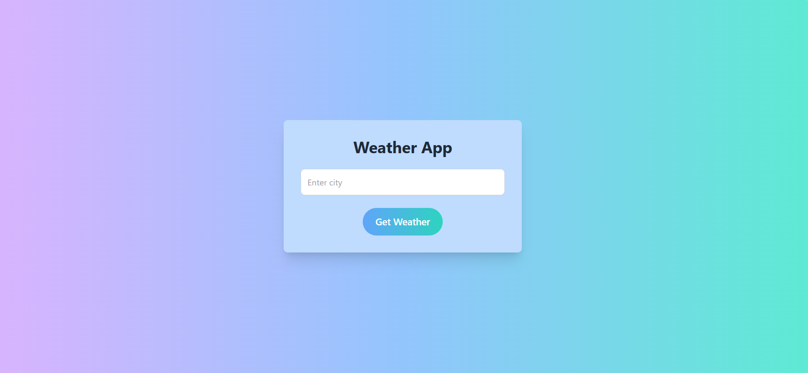
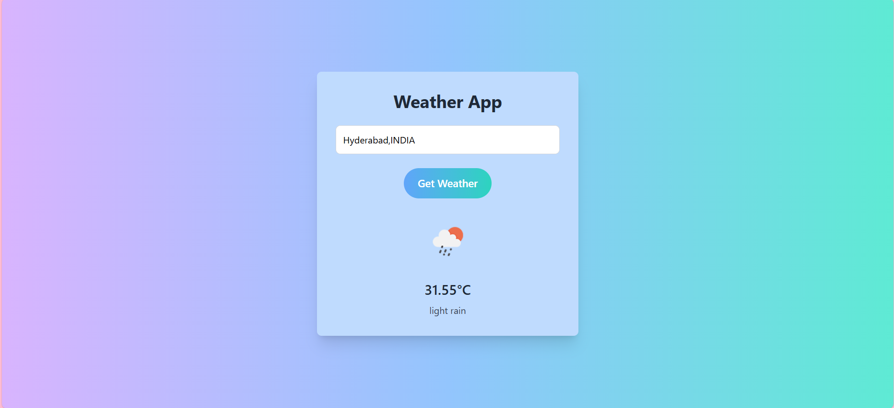

# 🌤️ Weather Website

A simple and elegant weather website built using **HTML**, **Tailwind CSS**, and **JavaScript**, powered by **Vite** for environment variable support. It fetches live weather data from a public API using a securely stored API key.

## Screenshots





## 🧩 Features

- 🌆 Search for weather info by city name
- 🔐 API key hidden using `.env` and Vite's `import.meta.env`
- 💨 Instant weather data fetching via JavaScript
- 🎨 Styled beautifully with Tailwind CSS
- ⚡ Fast development experience using Vite

## 🛠️ Tech Stack

- HTML5
- Tailwind CSS
- JavaScript (ES6)
- [Vite](https://vitejs.dev/)
- Weather API (e.g., OpenWeatherMap)

## API Link
https://home.openweathermap.org/

## API Key Link
https://home.openweathermap.org/api_keys

## Steps for creating API KEY
Sure Liang! Here's a quick and clear guide on how to create an **API key** for the **OpenWeatherMap API**, which is what you're probably using in your weather app.

---

### ✅ **Steps to Create an OpenWeatherMap API Key**

#### 🌐 1. Go to [OpenWeatherMap](https://home.openweathermap.org/users/sign_up)
- Create a free account (or log in if you already have one).

---

#### 🔐 2. After Login, Go to:  
[**My API keys**](https://home.openweathermap.org/api_keys)

---

#### ➕ 3. Create a New API Key
- You’ll see a default key already (e.g., `default`).
- Click **“+ Create Key”** or just **edit the default one’s name**.
- Give it a name like `"WeatherApp2025"` and click **Generate**.

---

#### ⏱ 4. Wait for Activation
- Sometimes it takes **up to 2 hours** to become fully active.
- But usually works within a few minutes.

---

#### 🧪 5. Use the Key in Your Code
Replace `YOUR_API_KEY_HERE` with your new key:

```js
const API_KEY = 'your_actual_api_key_here';
```

## 🚀 Getting Started

### 1. Clone the Repository

```bash
git clone https://github.com/your-username/weather-website.git
cd weather-website
```

### 2. Install Dependencies

```bash
npm install
```

### 3. Create a `.env` File

In the root directory, add your API key like this:

```env
VITE_API_KEY=your_actual_api_key_here
```

> Make sure it starts with `VITE_` so Vite can expose it to the browser.

### 4. Start the Development Server

```bash
npm run dev
```

Then open your browser and go to: [http://localhost:5173](http://localhost:5173)

## 📁 Project Structure

```
WEATHER-WEBSITE/
├── .vscode/
│   └── settings.json        # VS Code workspace settings
├── weather/
│   ├── node_modules/      # npm dependencies (not typically committed)
│   ├── public/            # Static assets (HTML, images, etc.)
│   └── src/               # Main source code
│       └── main.js          # Entry point of the JavaScript application
├── .env                   # Environment variables (add to .gitignore)
├── .gitignore             # Specifies files to ignore in Git
├── index.html             # Main HTML file
├── package-lock.json      # Exact dependency versions
├── package.json           # Project metadata and dependencies
├── LICENSE                # Licensing information
└── README.md              # Project documentation (this file)
```

## 🔒 Notes on API Key

- The `.env` file is included in `.gitignore` to keep the API key secret.
- In production, consider using a backend to fully protect the API key.

## 📃 License

This project is open-source and available under the [MIT License](LICENSE).
